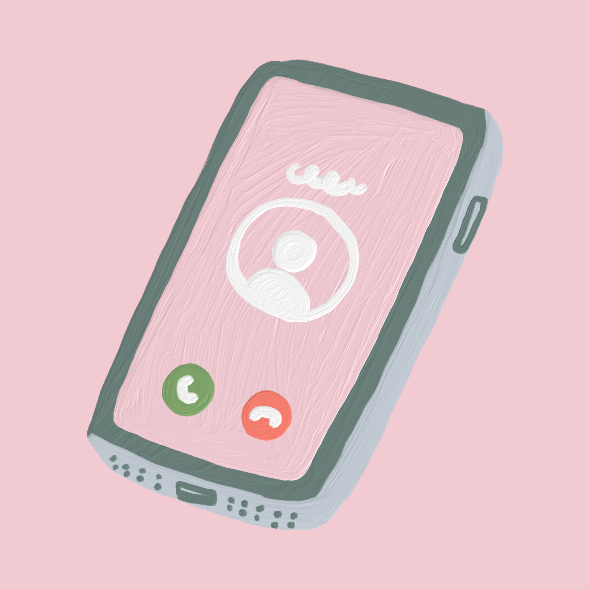
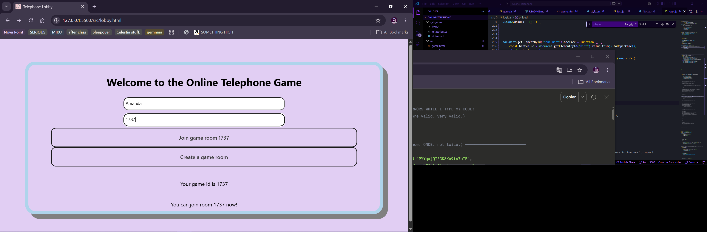

# Online-Telephone
A Game of Telephone involving 3 or more players simultaneously!

Yk that whisper game where someone says a word and it gets passed down a line of people and the final person has a completely different word?

This is it, but online

This project taught me so much like how if you want to do something which an html object in javascript: define it in the function block first! with a name. it will be more functional and your code wil be cleaner

PLEASE BE PATIENT AND DONT CLICK THE JOIN BUTTON MULTIPLE TIMES IF NOT IT WILL BREAK MY GAME

NEVER CODE AT 4AM, THERE WILL BE GHOSTS IN YOUR CODE

please please please read the readme before playing.

do not try to break this game.

reaload the lobby if you accidentally click the join game button. if your game randomly breaks. please make a new game in a new game room

Sincerely, I have no idea why I decided to do this project.
and it failed, heh.
Yeah, apparently firebase db is no good for a game.

I hope you enoy the tic tac toe!
I'll most likely do more projects that are better polished in the future.

Goodbye!

This was a learnging project

it taught me about sing the firebase realtime db. it made me cry alot. 2 hours to the dealine I had to restart my javascript. I honestly have no idea what to write in my readme. Peace!

# What did I learn?
How problematic coding can be, but also how clea css can make your website look, as well as integrating math. random which i learned a while a go. I might have not succeded at my set goal just this time. but this is a stepping stone to it.

You can check out notes.md if you want

# Design

# I made this with the help of: 

